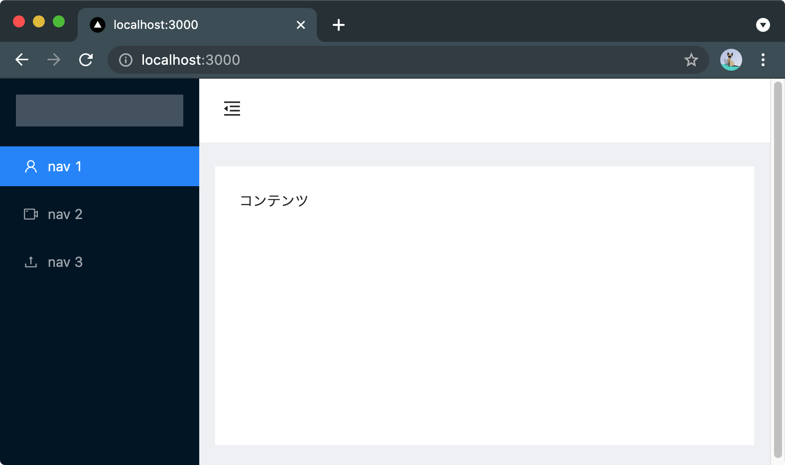

# Next.js + Ant Design + TypeScriptのデモ

Next.jsでAnt Designを使うデモです。

## Next.jsプロジェクトを生成する

```bash
mkdir nextjs-ant-design-typescript
cd nextjs-ant-design-typescript
npx create-next-app --ts .
```

## Gitリポジトリを初期化する

```bash
rm -rf .git
git init
git commit --allow-empty --message="chore: 🤖 new repo"
git add -A
git commit --allow-empty --message="chore: 🤖 add generated Next.js code"
```

## Next.jsの開発サーバーを起動する

次のコマンドを実行して開発サーバーが起動できればOK:

```bash
yarn dev
```


## Ant Designパッケージをインストールする

```bash
yarn add antd
```

## 管理画面レイアウトを作る

[layouts/adminLayout.tsx](./layouts/adminLayout.tsx)を実装する:

```tsx
import {
  MenuFoldOutlined,
  MenuUnfoldOutlined,
  UploadOutlined,
  UserOutlined,
  VideoCameraOutlined,
} from "@ant-design/icons";
import { Layout, Menu } from "antd";
import { ReactNode, useState } from "react";
import styles from "./adminLayout.module.css";

const { Header, Sider, Content } = Layout;

function AdminLayout({ children }: { readonly children: ReactNode }) {
  const [collapsed, setCollapsed] = useState<boolean>(false);

  function toggle() {
    setCollapsed(!collapsed);
  }

  return (
    <Layout>
      <Sider trigger={null} collapsible collapsed={collapsed}>
        <div className={styles.logo} />
        <Menu theme="dark" mode="inline" defaultSelectedKeys={["1"]}>
          <Menu.Item key="1" icon={<UserOutlined />}>
            nav 1
          </Menu.Item>
          <Menu.Item key="2" icon={<VideoCameraOutlined />}>
            nav 2
          </Menu.Item>
          <Menu.Item key="3" icon={<UploadOutlined />}>
            nav 3
          </Menu.Item>
        </Menu>
      </Sider>
      <Layout className="site-layout">
        <Header className={styles.siteLayoutBackground} style={{ padding: 0 }}>
          {collapsed ? (
            <MenuUnfoldOutlined className={styles.trigger} onClick={toggle} />
          ) : (
            <MenuFoldOutlined className={styles.trigger} onClick={toggle} />
          )}
        </Header>
        <Content
          className={styles.siteLayoutBackground}
          style={{
            margin: "24px 16px",
            padding: 24,
            minHeight: 280,
          }}
        >
          {children}
        </Content>
      </Layout>
    </Layout>
  );
}

export default AdminLayout;
```

管理画面レイアウト用のCSSモジュールも[layouts/adminLayout.module.css](./layouts/adminLayout.module.css)に作る:

```css
.trigger {
    padding: 0 24px;
    font-size: 18px;
    line-height: 64px;
    cursor: pointer;
    transition: color 0.3s;
}

.trigger:hover {
    color: #1890ff;
}

.logo {
    height: 32px;
    margin: 16px;
    background: rgba(255, 255, 255, 0.3);
}

.siteLayoutBackground {
    background: #fff;
}
```

## pages/_app.tsxにてAnt DesignのグローバルCSSをimportする

[pages/_app.tsx](./pages/_app.tsx)に次の行を追加する:

```ts
import 'antd/dist/antd.css';
```

## 管理画面レイアウトをページで使う

[pages/index.tsx](./pages/index.tsx)のコードをまるっと次のコードに置き換える:

```tsx
import dynamic from "next/dynamic";

const AdminLayout = dynamic(() => import("../layouts/adminLayout"), {
  ssr: false,
});

export default function Home() {
  return <AdminLayout>コンテンツ</AdminLayout>;
}
```

`dynamic`で`import`しているのは、Ant Designの`Layout`コンポーネントが依存するコンポーネントで`useLayoutEffect`が使われているため。SSRを無効にする必要がある。次のissueが直るまでの対処法。

- [Select mode="multiple" throws useLayoutEffect warning in Next.js · Issue #30396 · ant-design/ant-design](https://github.com/ant-design/ant-design/issues/30396)

次のような見た目になればOK:


